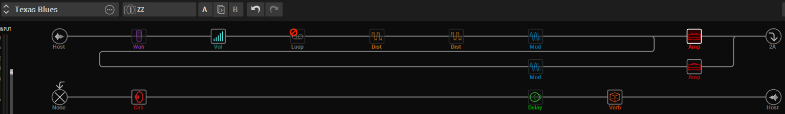

# :gear: Collection of Resources for the Line 6 Helix
- :control_knobs: https://line6.com/helix/
- :wrench: https://helixhelp.com/tips-and-guides/helix/welcome
- :memo: https://hmon.ir/helix/fx_finder.htm
- :hotdog: https://hotdogs.no

Table of Contents
1. [Some notes on the IR formats](#some-notes-on-the-ir-formats)
2. [The Allure Pack](#the-allure-pack)
3. [Other favourite IR's](#other-favourite-irs)
4. [My Favourite HELIX-patch](#my-favourite-helix-patch)
5. [Some links to Free IR's](#some-links-to-free-irs)
6. [Licensing](#licensing)
7. [Versions](#versions)

## Some notes on the IR formats
### Helix (mono_16bit_48kHz_200ms_2048)
Helix supports nearly all IRs in .WAV format. However, the Helix Edit application may automatically change its attributes before sending it to the Helix hardware:
* Converts all .WAV IRs to 16-bit, 48kHz mono; when loading a stereo file, Helix Edit uses only the left side.
* Shortens (or lengthens) the IR to 2,048 samples. The user may choose a 1,024-sample version to save DSP, which fades out the IR halfway through.

### Powercab (mono_24bit_48000Hz_43ms_2048)
The Powercab 112 Plus device can import IRs by way of the Powercab Edit software.
It is possible to import any mono or stereo .wav file IR, regardless of its bit depth, length, or sample rate frequency.
Once imported, the .wav files are automatically conformed to the compatible IR properties (48kHz, 24-bit, mono, 2048 samples, aka 2048/48000 ~ 43ms)

## The Allure Pack 
The Allure Pack is a set of free IRs (impulse responses) created by Dan Boul of [65 Amps](http://65amps.com). Its goal is to emulate the unique dynamic mic’ing style of a world-famous producer known for his impressive guitar tones.
* Allure = attraction, charm, or excitement, not to be confused by Zoot Allures = Frank Zappa album where the title is a pun on the French expression "Zut alors!", which conveys "dammit".

| Filename                                                                             | Origin                    | Notes                                          | 
| :--                                                                                  | :--                       | :--                                            | 
| [Allure_59_Tweed_P10N.wav](./Allure_59_Tweed_P10N.wav)                               | Line 6 Allure IR Pack     | https://line6.com/allure/                      |
| [Allure_64_A30_G12.wav](./Allure_64_A30_G12.wav)                                     | Line 6 Allure IR Pack     | https://line6.com/allure/                      | 
| [Allure_64_USDeluxe_P12N.wav](./Allure_64_USDeluxe_P12N.wav)                         | Line 6 Allure IR Pack     | https://line6.com/allure/                      | 
| [Allure_67_Brit_Greenback.wav](./Allure_67_Brit_Greenback.wav)                       | Line 6 Allure IR Pack     | https://line6.com/allure/                      | 
| [Allure_70s_WhoWatt_100.wav](./Allure_70s_WhoWatt_100.wav)                           | Line 6 Allure IR Pack     | https://line6.com/allure/                      | 
| [Allure_90s_Cali_V30.wav](./Allure_90s_Cali_V30.wav)                                 | Line 6 Allure IR Pack     | https://line6.com/allure/                      | 

## Other favourite IR's
| Filename                                                                             | Origin                    | Notes                                          | 
| :--                                                                                  | :--                       | :--                                            | 
| [Cenzo Celestion V30 Mix.wav](./Cenzo%20Celestion%20V30%20Mix.wav)                   | Cenzo Townsend            | https://www.celestionplus.com/free-download/   | 
| [OH 412 MES-ST V60 421-04.wav](./OH%20412%20MES-ST%20V60%20421-04.wav)               | OwnHammer                 | https://ownhammer.com/                         |
| [OH 412 MES-ST V60 57-00.wav](./OH%20412%20MES-ST%20V60%2057-00.wav)                 | OwnHammer                 | https://ownhammer.com/                         | 
| [OH 412 TRAD V30-MB1 L BALANCED.wav](./OH%20412%20TRAD%20V30-MB1%20L%20BALANCED.wav) | OwnHammer                 | https://ownhammer.com/                         | 

 
## My Favourite HELIX-patch

This consist of two amps in parallel; Line 6 Litigator and Brit J45. Teemah!, Minotaur, Trinity Chorus, Tremolo, Tape Delay and '63 spring reverb, 4x12 Blackback 30 Cab. (Think ZZ Top)
* [Texas Blues.hlx](./Texas%20Blues.hlx)  

## Some links to Free IR's
* https://overdriven.fr/overdriven/
* https://www.acousticir.ovh/
* https://redwirez.com/pages/the-marshall-1960a-ir-pack

## Licensing

This stuff is licensed with a Creative Commons BY-NC-SA 4.0 license (Attribution, Non-commercial, Share-alike).
 
## Versions
* v1.1 - Added TOC and merged some more text
* v1.0 - First version
